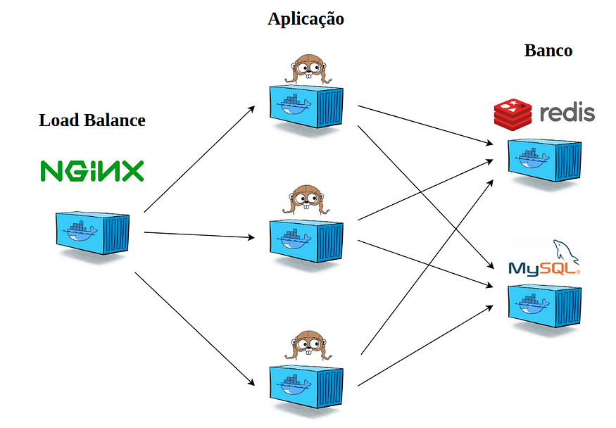

# Gerenciamento de notícias

Projeto utilizando Golang para genciamento de notícias.

### Estrutura de containeres da aplicação



### Tecnologias

Utiliza-se as seguintes tecnologias para o funcionamento desse sistema:

* [Go] - Linguagem de programação
* [GORM] - ORM para Golang
* [Mysql] - Banco de dados relacional
* [Redis] - Datastore de chave e valor
* [Docker] - Administrador de containers

### Pré-requisitos
 - Docker e Docker Compose instalado e configurado

### Instalação

Assume que atenda aos pré-requisitos informados acima para seguir com os passos abaixo:

Clonando o repositório

```sh
$ git clone https://github.com/edujudici/gonoticias.git
```

Buildar aplicação

```sh
$ docker compose build
```

Start da aplicação

```sh
$ docker compose up
```

### Como acessar

 - Acessando o sistema: [localhost](http://localhost:80/)

License
----

MIT

[//]: # (These are reference links used in the body of this note and get stripped out when the markdown processor does its job. There is no need to format nicely because it shouldn't be seen. Thanks SO - http://stackoverflow.com/questions/4823468/store-comments-in-markdown-syntax)


   [Go]: <https://tip.golang.org/>
   [GORM]: <https://github.com/jinzhu/gorm>
   [Mysql]: <https://www.mysql.com/>
   [Redis]: <https://redis.io/>
   [Docker]: <https://www.docker.com/>
